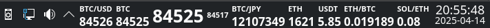

# Another Plasma6 Coin

<br><br><br>
<br><br><br>

__Another Plasma6 Coin__ is a Plasma 6 (KDE) applet to show the price of Bitcoin and other cryptocurrencies in KDE toolbar.

This program was initially based on [Plasma Coin 1.0.2](https://store.kde.org/p/2242677/), written by [zayronXIO](https://store.kde.org/u/zayronXIO).

I am an anonymous programmer and I developed this applet for my personal utilization. Feel free to send pull requests.


## How to install

### Automatic install

The best way to install this applet is via widget manager from KDE.

1. Right-Click over the toolbar and select Add or Manage Wiggets.
2. Select `Get New` > `Download New Plasma Widgets` > `Another Plasma6 Coin`.
3. Click Install button.
4. Right-Click again over the toolbar and select `Add or Manage Wiggets`.
5. Select `Another Plasma6 Coin` and drag it to the toolbar.
6. Right-Click over the applet in toolbar and select `Configure Another Plasma6 Coin`.

### Manual install

Another way to install __Another Plasma6 Coin__ is to make it manually.

1. Copy the directory `Another.Plasma6.Coin` to `~/.local/share/plasma/plasmoids/`
2. Run `$ kquitapp6 plasmashell && kstart plasmashell` or restart KDE.
3. Right-Click over the toolbar and select `Add or Manage Wiggets`.
4. Select `Another Plasma6 Coin` and drag it to the toolbar.
5. Right-Click over the applet in toolbar and select `Configure Another Plasma6 Coin`.

## Options (configuration)

<br><br><br>

There are some options in `Configuration` window.

* The `Font Size for Price` will determine the size of the price. The name of the coin will be shown above the price and size of this will be 70% of the price size.
* `Bold` is for price and coin name.
* `From Crypto` will select the cryptocurrency and `To Crypto/Currency` will select the pair to be utilized.
* `Show Coin Name` and `Show Pair`: only one of these can be selected, but both can be unselected.
* `Decimal Places` is for fractional numbers.
* The price will be updated every 3 minutes.

## Hacking the source code

### New coins and currencies

__Another Plasma6 Coin__ arrives with a limited number of coins and currencies. It is possible to add new items.

> [!IMPORTANT]
> All prices are taken from [CoinGecko](https://www.coingecko.com) via API, so is needed to use the same names from CoinGecko for currencies.

* For coins:
  * Edit `~/.local/share/plasma/plasmoids/Another.Plasma6.Coin/contents/ui/CoinModel.qml` and add a new entry.
  * You must use the same `name` provided by CoinGecko via API. There is a list [here](https://www.coingecko.com/en/all-cryptocurrencies). Click the cursor over a coin name and observe its name at the end of the URL. E.g.: for Ethereum Classic, we have `https://www.coingecko.com/en/coins/ethereum-classic`, so `ethereum-classic` must be used if needed.
  * Example of an entry to be added:
    ```
    ListElement { name: "solana"; abbreviation: "SOL" }
    ```
  * In the last example, `solana` is the name to be used to call the CoinGecko API and `SOL` is the ticker (symbol) to be shown in the KDE toolbar.

* For currencies:
  * Edit `~/.local/share/plasma/plasmoids/Another.Plasma6.Coin/contents/ui/CurrencyModel.qml` and add a new block.
  * There is a list of currencies [here](https://docs.coingecko.com/reference/simple-supported-currencies).
  * Example of a block:
  ```
  ListElement {
      name: "US Dollar"
      abbreviation: "usd"
      symbol: "$"
  }
  ```
  * In the last example, `US Dollar` is a name to visual identification of the currency in configuration block. `usd` will be used to call the CoinGecko API and to compose the pair name in the KDE toolbar. Currently, the `symbol` is not used.

__TIP:__ It is possible to make tests against the CoinGecko API using the `curl` command. See an example for BTC/USD:

```
$ curl 'https://api.coingecko.com/api/v3/simple/price?ids=bitcoin&vs_currencies=usd'
```

In the last command, if you receive the error 429, wait for 5 seconds and try again. An empty reply "`{}`" mains the coin price is not available via FREE API or the coin/currency name was wrong typed.

### Crypto/Currency names size

The size of the Crypto/Currency names is 70% (0.7) of the price size. This can be changed at `~/.local/share/plasma/plasmoids/Another.Plasma6.Coin/contents/ui/CompactRepresentation.qml`. Search for `0.7`.

### Time refresh

The time refresh for prices is 3 minutes. This can be changed at `~/.local/share/plasma/plasmoids/Another.Plasma6.Coin/contents/ui/components/GetAPI.qml`. Search for `refreshRate: 3`.

> [!IMPORTANT]
> Avoid using less than 3 minutes because CoinGecko can dislike this.

## Limitations

* CoinGecko discards intensive calls. I recommend do not use more than 5 widgets at the same time to avoid lose prices or to be blocked.
* CoinGecko free API is a bit limited and it doesn't make available all possible coins.
