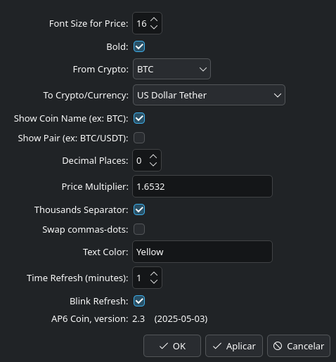

# Another Plasma6 Coin (A.P6.C)

<br><br><br>
<br><br><br>
<br><br><br>

__Another Plasma6 Coin__ is a Plasma 6 (KDE) applet to show the price of Bitcoin and other cryptocurrencies in KDE toolbar.

This program was initially based on [Plasma Coin 1.0.2](https://store.kde.org/p/2242677/), written by [zayronXIO](https://store.kde.org/u/zayronXIO).

I am an anonymous programmer and I developed this applet for my personal utilization. Feel free to send pull requests.

> [!NOTE]
> This applet is available at [KDE Store](https://store.kde.org/p/2280323).

## How this applet works

A.P6.C gets prices from [Binance API](https://github.com/binance/binance-spot-api-docs), since version 2.0. Older versions were using [CoinGecko API](https://docs.coingecko.com/reference/introduction).

Binance API x CoinGecko API:

* Binance API is faster than CoinGecko API.
* Binance API has less limitations. You can access several pairs of coins at the same time.
* In April 18, 2025, CoinGecko API was providing 100 coins under USD[1], while Binance had 573 under USDT[2].

```
[1] $ curl -s 'https://api.coingecko.com/api/v3/coins/markets?vs_currency=usd' | tr ',' '\n' | grep '"id":' | wc -l
[2] $ curl -s https://api.binance.com/api/v3/ticker/price | tr '{' '\n' | egrep '[A-Z]USDT' | wc -l
```

If you are interested in CoinGecko, see the branch [`ap6c-1.2.1-coingecko-archived`](https://github.com/bitcoin-crazy/another-plasma6-coin/tree/ap6c-1.2.1-coingecko-archived) on this Git repository or download the [version 1.2](https://github.com/bitcoin-crazy/another-plasma6-coin/releases/tag/v1.2).

This applet will show the price of coins in toolbar and it has the following resources and features:

* Update of prices every 3 minutes.
* Retry after 1 minute if the last call fails.
* Immediate update of a price when clicking over it.
* Possibility to use decimal places.
* Possibility to show the name of the coin, or the name of coin and the currency, or none.
* Possibility to apply colors to prices.
* The `ERR` (Error) message will be shown when a wrong pair of coins is selected or when occurs other error.

## How to install

### Automatic install

The best way to install this applet is via widget manager from KDE.

1. Right-Click over the toolbar and select `Add or Manage Widgets`.
2. Select `Get New` > `Download New Plasma Widgets` > `Another Plasma6 Coin`.
3. Click Install button.
4. Right-Click again over the toolbar and select `Add or Manage Widgets`.
5. Select `Another Plasma6 Coin` and drag it to the toolbar.
6. Right-Click over the applet in toolbar and select `Configure Another Plasma6 Coin`.

### Importing the tarball

Another way to install __Another Plasma6 Coin__ is to make it importing the tarball.

1. Download the final tarball `Another.Plasma6.Coin-<version>.tar.xz`
2. Right-Click over the toolbar and select `Add or Manage Widgets`.
3. Select `Get New` > `Install Widget From Local File`.
4. Select the downloaded tarball.
5. Click `Add or Manage Widgets`.
6. Select `Another Plasma6 Coin` and drag it to the toolbar.
7. Right-Click over the applet in toolbar and select `Configure Another Plasma6 Coin`.

### Manual install

Another way to install __Another Plasma6 Coin__ is to make it manually.

1. Copy the directory `Another.Plasma6.Coin` to `~/.local/share/plasma/plasmoids/`
2. Run `$ kquitapp6 plasmashell && kstart plasmashell` or restart KDE.
3. Right-Click over the toolbar and select `Add or Manage Widgets`.
4. Select `Another Plasma6 Coin` and drag it to the toolbar.
5. Right-Click over the applet in toolbar and select `Configure Another Plasma6 Coin`.

## Options (configuration)

<br><br><br>

There are some options in `Configuration` window.

* The `Font Size for Price` will determine the size of the price. The name of the coin will be shown above the price and size of this will be 70% of the price size.
* `Bold` is for price and coin name.
* `From Crypto` will select the cryptocurrency and `To Crypto/Currency` will select the pair to be utilized.
* `Show Coin Name` and `Show Pair`: only one of these can be selected, but both can be unselected.
* `Decimal Places` is for fractional numbers.
* `Text Color` allows the user to choose a color for the price. If empty, the default theme color will be shown. It is possible to use a color name (like `yellow`, `yellowgreen`) or a hex color code (like `#00ff00` or `#00FF00`). The character "`#`" is mandatory for hex colors.

## Hacking the source code

### New coins and currencies

__Another Plasma6 Coin__ arrives with a limited number of coins and currencies. It is possible to add new items.

> [!IMPORTANT]
> All prices are taken from [Binance](https://www.binance.com) via API, so is needed to use the same names from Binance.

* For coins:
  * Edit `~/.local/share/plasma/plasmoids/Another.Plasma6.Coin/contents/ui/CoinModel.qml` and add a new entry.
  * You must use the same `name` provided by Binance via API. See __TIP1__ below.
  * Example of an entry to be added:
    ```
    ListElement { name: "SOL" }
    ```
  * In the last example, `SOL` is the name to be used to call the Binance API.
  * It is not needed to restart KDE after adding new coins.

* For currencies:
  * Edit `~/.local/share/plasma/plasmoids/Another.Plasma6.Coin/contents/ui/CurrencyModel.qml` and add a new line.
  * You must use the same `abbreviation` provided by Binance via API. See __TIP1__ below.
  * Example of a line:
    ```
    ListElement { name: "British Pound" ; abbreviation: "GBP" }
    ```
  * In the last example, `British Pound` is a name to visual identification of the currency in configuration block. `GBP` will be used to call the Binance API and to compose the pair name in the KDE toolbar.
  * It is not needed to restart KDE after adding new currencies.

__TIP1:__ The Binance API provides a restricted number of coins. It is possible to get a list using the  `curl` command.

  ```
  $ curl -s https://api.binance.com/api/v3/ticker/price | tr '{' '\n' | egrep '[A-Z]USDT'
  ```

In the last example, the prices were filtered to show USDT pairs only. Remove `| egrep '[A-Z]USDT'` to see all available pairs.

It is also possible to get a list of available currencies for BTC and USDT:

  ```
  $ curl -s https://api.binance.com/api/v3/ticker/price | tr '{' '\n' | egrep '"(BTC|USDT)' | sort
  ```

__TIP2:__ It is possible to make tests against the Binance API using the `curl` command. See an example for BTC/USDT:

  ```
  $ curl -s https://api.binance.com/api/v3/ticker/price?symbol=BTCUSDT
  ```

The errors from Binance API are very comprehensive. Read carefully each message returned at the shell prompt.

### Crypto/Currency names size

The size of the Crypto/Currency names is 70% (0.7) of the price size. This can be changed at `~/.local/share/plasma/plasmoids/Another.Plasma6.Coin/contents/ui/CompactRepresentation.qml`. Search for `0.7`.

### Time refresh

The time refresh for prices is 3 minutes. This can be changed at `~/.local/share/plasma/plasmoids/Another.Plasma6.Coin/contents/ui/components/GetAPI.qml`. Search for `refreshRate: 3`.

> [!IMPORTANT]
> Avoid using less than 1 minute because Binance API can dislike this.
